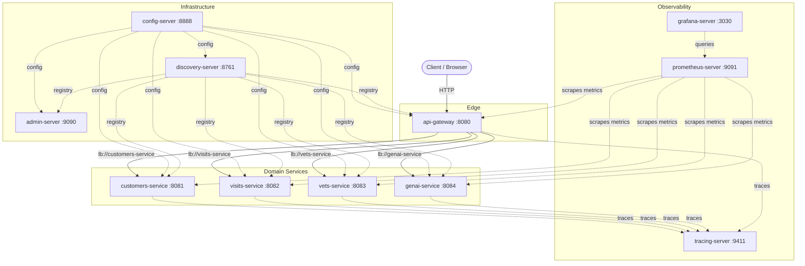

# Spring PetClinic Microservices — Architecture

This document describes the microservices architecture of the Spring PetClinic application, including all services, their ports, inter-service communication, and the Spring Cloud technologies that tie them together.

---

## Architecture Diagram



---

## Services and Ports

### Infrastructure Services

| Service | Image | Port |
|---|---|---|
| `config-server` | `springcommunity/spring-petclinic-config-server` | 8888 |
| `discovery-server` | `springcommunity/spring-petclinic-discovery-server` | 8761 |
| `admin-server` | `springcommunity/spring-petclinic-admin-server` | 9090 |

### Domain Services

| Service | Image | Port |
|---|---|---|
| `customers-service` | `springcommunity/spring-petclinic-customers-service` | 8081 |
| `visits-service` | `springcommunity/spring-petclinic-visits-service` | 8082 |
| `vets-service` | `springcommunity/spring-petclinic-vets-service` | 8083 |
| `genai-service` | `springcommunity/spring-petclinic-genai-service` | 8084 |

### Edge Service

| Service | Image | Port |
|---|---|---|
| `api-gateway` | `springcommunity/spring-petclinic-api-gateway` | 8080 |

### Observability

| Service | Image | Port |
|---|---|---|
| `tracing-server` | `openzipkin/zipkin` | 9411 |
| `grafana-server` | Built from `./docker/grafana` | 3030 (maps to 3000 internally) |
| `prometheus-server` | Built from `./docker/prometheus` | 9091 (maps to 9090 internally) |

---

## Spring Cloud Technologies

### Service Discovery — Spring Cloud Netflix Eureka

The system uses **Spring Cloud Netflix Eureka** for service discovery:

1. **Eureka Server** runs as the `discovery-server` on port **8761**.
2. All domain services and the `api-gateway` register themselves with Eureka on startup.
3. The `api-gateway` (Spring Cloud Gateway) uses Eureka-backed, load-balanced URIs (`lb://`) to route requests to downstream services. Routes are defined in `spring-petclinic-api-gateway/src/main/resources/application.yml` (lines 20–44):

   ```yaml
   routes:
     - id: vets-service
       uri: lb://vets-service
       predicates:
         - Path=/api/vet/**
     - id: visits-service
       uri: lb://visits-service
       predicates:
         - Path=/api/visit/**
     - id: customers-service
       uri: lb://customers-service
       predicates:
         - Path=/api/customer/**
     - id: genai-service
       uri: lb://genai-service
       predicates:
         - Path=/api/genai/**
   ```

   The `lb://` scheme tells Spring Cloud Gateway to resolve the service name through Eureka and load-balance across registered instances.

### Centralized Configuration — Spring Cloud Config Server

The system uses **Spring Cloud Config Server** (`config-server` on port **8888**) for centralized, externalized configuration.

Every Spring Boot service imports its configuration from the Config Server. When running locally the URL defaults to `http://localhost:8888/`; when running with the **`docker`** profile the URL switches to the container hostname:

```yaml
# default profile
spring:
  config:
    import: optional:configserver:${CONFIG_SERVER_URL:http://localhost:8888/}

# docker profile
---
spring:
  config:
    activate:
      on-profile: docker
    import: configserver:http://config-server:8888
```

This pattern is repeated in every service (e.g., `spring-petclinic-discovery-server/src/main/resources/application.yml` lines 15–21).

### API Gateway — Spring Cloud Gateway

The `api-gateway` is the single entry point for external traffic. It uses **Spring Cloud Gateway** with:

- **Eureka-backed routing** via `lb://` URIs (see above).
- **CircuitBreaker** (Resilience4j) as a default filter, with a fallback URI (`forward:/fallback`).
- **Retry** filter for `SERVICE_UNAVAILABLE` responses on POST requests.
- A dedicated `genaiCircuitBreaker` for the GenAI service route.

---

## The `docker` Spring Profile

When services run inside Docker Compose, the **`docker`** Spring profile is activated. This profile changes a single critical setting: the Config Server URL switches from `localhost` to the Docker container hostname `config-server`:

```
configserver:http://config-server:8888
```

Because all containers share the Docker Compose default bridge network, they can resolve each other by container name. Eureka registration then uses these hostnames so that inter-service calls (routed through the gateway's `lb://` URIs) also resolve via Docker DNS.

---

## Startup Order

The startup dependency chain is defined in `docker-compose.yml` using health checks and `depends_on` with `condition: service_healthy`:

```
1. config-server             (no dependencies — starts first)
2. discovery-server           (waits for config-server to be healthy)
3. customers-service  ─┐
   visits-service     │
   vets-service       ├──── (each waits for both config-server AND discovery-server)
   genai-service      │
   api-gateway        │
   admin-server       ─┘
```

The observability stack (`tracing-server`, `grafana-server`, `prometheus-server`) has no `depends_on` constraints and starts independently.

`scripts/run_all.sh` mirrors this order for local (non-Docker) runs: it starts the config server first, sleeps 20 s, then the discovery server, sleeps 20 s, then launches all remaining services in parallel.
