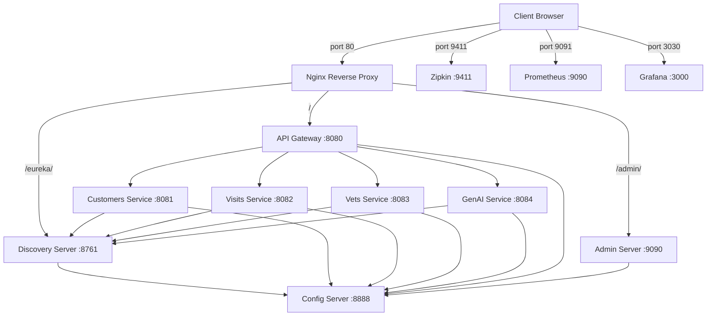

# Spring PetClinic Microservices — Docker Playbook

## Overview

The Spring PetClinic Microservices application is a distributed system composed of:

- **8 Java/Spring Boot services**: Config Server, Discovery Server, API Gateway, Customers Service, Visits Service, Vets Service, GenAI Service, Admin Server
- **3 observability containers**: Zipkin (tracing), Prometheus (metrics), Grafana (dashboards)
- **1 Nginx reverse proxy**: Single entry point for all HTTP traffic

All services communicate over a dedicated Docker bridge network (`petclinic-net`). Only the Nginx proxy and observability UIs are exposed to the host.

## Architecture Diagram



## Prerequisites

- **Docker** (v20.10+)
- **Docker Compose** v2
- **Minimum 8 GB RAM** allocated to Docker (all services combined require significant memory)
- **Java 17** and **Maven** (only if building images locally)

## Building

Build all service Docker images from the project root:

```bash
./mvnw clean install -PbuildDocker
```

This compiles each microservice and produces a layered Docker image via the shared `docker/Dockerfile`.

## Starting

Start the entire stack in detached mode:

```bash
docker compose up -d
```

Services start in dependency order enforced by health checks:

1. Config Server (no dependencies)
2. Discovery Server (waits for Config Server to be healthy)
3. All application services (wait for Config Server + Discovery Server)
4. Nginx reverse proxy (waits for API Gateway to be healthy)

## Verifying Health

Check that all services are running and healthy:

```bash
docker compose ps
```

All containers should show `healthy` in the STATUS column. If a service shows `starting`, wait for it to complete its boot sequence (Java services may take 30–60 seconds).

## Endpoints

### Via Nginx (port 80 — single entry point)

| URL | Routes To |
|-----|-----------|
| `http://localhost/` | API Gateway (PetClinic UI) |
| `http://localhost/eureka/` | Eureka Discovery Dashboard |
| `http://localhost/admin/` | Spring Boot Admin |

### Direct Observability Access

| URL | Service |
|-----|---------|
| `http://localhost:9411` | Zipkin Tracing UI |
| `http://localhost:3030` | Grafana Dashboards |
| `http://localhost:9091` | Prometheus UI |

## Health Check Details

| Service | Port | Health Endpoint |
|---------|------|-----------------|
| config-server | 8888 | `/actuator/health` |
| discovery-server | 8761 | `/actuator/health` |
| customers-service | 8081 | `/actuator/health` |
| visits-service | 8082 | `/actuator/health` |
| vets-service | 8083 | `/actuator/health` |
| genai-service | 8084 | `/actuator/health` |
| api-gateway | 8080 | `/actuator/health` |
| admin-server | 9090 | `/actuator/health` |
| tracing-server (Zipkin) | 9411 | `/health` |
| grafana-server | 3000 | `/api/health` |
| prometheus-server | 9090 | `/-/healthy` |
| nginx | 80 | `/` |

## Networking

All services are attached to the `petclinic-net` bridge network defined in `docker-compose.yml`. This provides:

- **DNS-based service discovery**: Containers resolve each other by service name (e.g., `config-server`, `discovery-server`)
- **Network isolation**: Only Nginx (port 80) and observability UIs (ports 9411, 3030, 9091) are exposed to the host
- **Internal-only communication**: Application services (customers, visits, vets, genai, api-gateway, config-server, discovery-server, admin-server) have no direct host port mappings

## Troubleshooting

### Services failing health checks

**Symptom**: Containers remain in `starting` or `unhealthy` state.

**Fix**: Increase `start_period` in the service's healthcheck configuration. Java/Spring Boot services may need 40–60 seconds on resource-constrained hosts:

```yaml
healthcheck:
  start_period: 60s
```

### `curl: not found` in health checks

**Symptom**: Health check logs show `exec: "curl": executable file not found`.

**Fix**: Rebuild Docker images to include the `curl` installation step added to `docker/Dockerfile`:

```bash
./mvnw clean install -PbuildDocker
```

### Port conflicts

**Symptom**: `docker compose up` fails with "port already in use".

**Fix**: Check for existing processes on the exposed ports:

```bash
# Check ports 80, 9411, 3030, 9091
sudo lsof -i :80
sudo lsof -i :9411
sudo lsof -i :3030
sudo lsof -i :9091
```

Stop conflicting services or adjust the host port mappings in `docker-compose.yml`.

### Config Server not starting

**Symptom**: All dependent services remain in `waiting` state.

**Fix**: Verify the Config Server image has been built and check its logs:

```bash
docker compose logs config-server
```

### GenAI Service issues

**Symptom**: GenAI service starts but AI features don't work.

**Fix**: Ensure environment variables are set before starting:

```bash
export OPENAI_API_KEY=your-key-here
docker compose up -d
```
